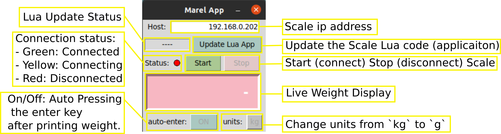

# marel_marine_scale_controller
Python Controller and Lua application for Marel Marine Scale M2200.

Note that this project was developed with the Marel Marine Scale M2200. Therefor, there are no guarantees that it will work with other models.


# Description

# Download

The App is packaged as standalone executable for Windows and Linux.
Download [here](https://github.com/iml-gddaiss/marel_marine_scale_controller/releases)

# Usage

## Scale


## GUI Python Application

{width=100 height=100}


# Additional Information
## About the Marel Marine Scale M2200
The Marel [documentation](./docs/marel_marine_m2200_user_guide.pdf) doesn't really tell you how to connect to and interact with the scale. The following explanation is thus mostly empirical. 

The scale has an empty Lua file in its memory. This file can be overwritten by uploading a Lua files to the scale. 
Then, if the scale (parameter](TODO: Add to Guide) "Run Lua Script" is `On`, the script is run in loop by a Lua interpreter.
IMPORTANT: It seems that a new Lua Interpreter is launch each time, thus the Lua Script should itself be looping to avoid closing and opening new interpreters which cost time.


The scale has 7 different tcp servers ports for communication, from the documentation we have:

+ 52200 dot commands
+ 52202 download Lua source, if allowed 
+ 52203 upload Lua source
+ 52210 Lua standard output, for example using Lua print()
+ 52211 message port “comm4” in Lua, persistent output queue
+ 52212 terminal port “comm5” in Lua
+ 52213 remote host port “comm6” in Lua 

Note:
- The Lua Script is uploaded via the `52202` download port, and downloaded form the `52203` upload port.
- The port `52211`, `52212` and `52213` can be use has Communications port.


While it seems that some of the "built-in" Lua functions are missing from the Lua interpreter (however I might be wrong here),
the Marel [documentation](./docs/marel_marine_m2200_user_guide.pdf) provides a list of available Lua functions with to interface with the scale and manipulate strings.
Using the Marel [documentation](./docs/marel_marine_m2200_user_guide.pdf) and the Lua script to be used with the Python app ([marel_app_v2.lua](marel_marine_scale_controller/static/marel_app_v2.lua)), one could make their own Lua Sript for the Scale.


## Lua Application:
Apart from the graphical user interface on the Sreen #2 of the scale (see section [Usage/Scale](#scale)), 
the [Lua application](marel_marine_scale_controller/static/marel_app_v2.lua) is used to send weight measurements over the ethernet communication port `5`(`52212`).
The messages format is as follows `%<prefix>,<weight><units>#\n`, where:
```
    prefix: `"w"` or `"p"`.
    weight: float of variable precision.
    units: Unit of the weight `("kg", "g", "lb", "oz")`.
```
e.g. `%w,1.234kg#\n`
Messages with the prefix `"w"` are sent at regular intervals while `"p"` messages are sent when the assign [button](TODO) on the Scale is pressed.
When receiving `"p"` messages, the Controller emulates a keyboard entry of that given values.


## The Python Controller 

The controller is used to:
    - Connect ot the Marel Scale via Ethernet.
    - Upload the Compatible Lua Application to the scale.
    - Store the latest weight value and units.
    - Print the latest received weight value in a given units at the current cursor position. (Keyboard Emulation)
