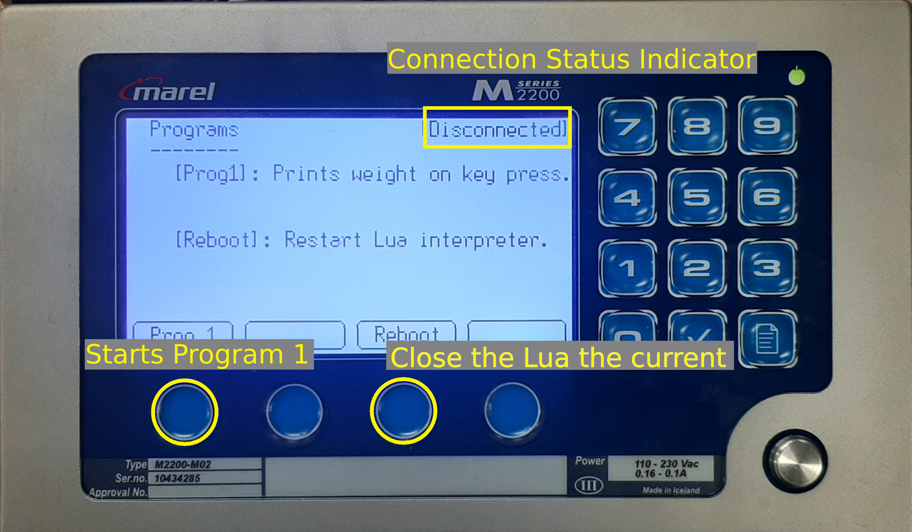
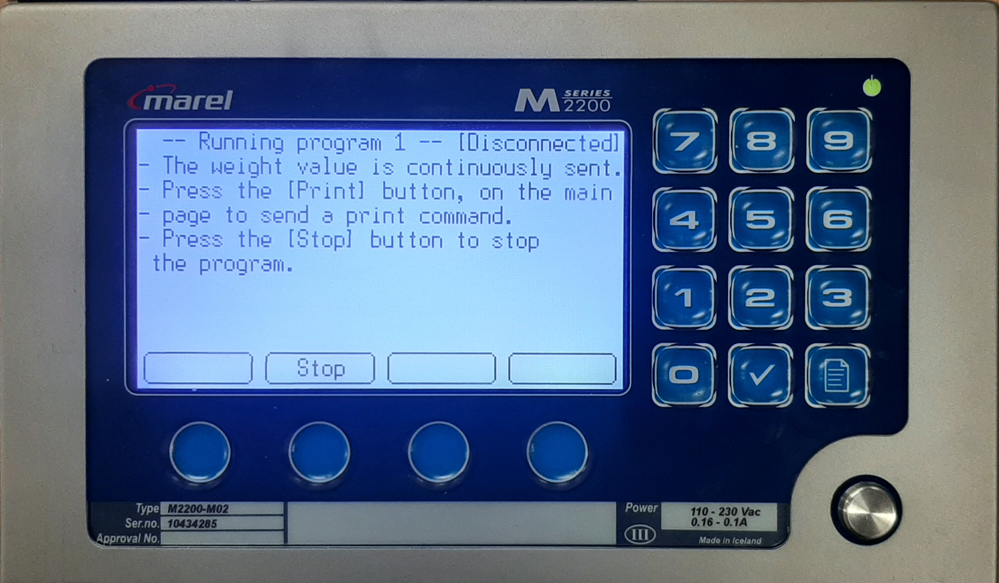
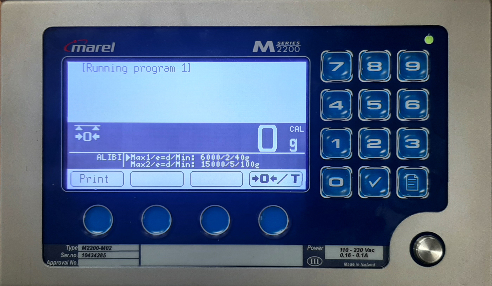
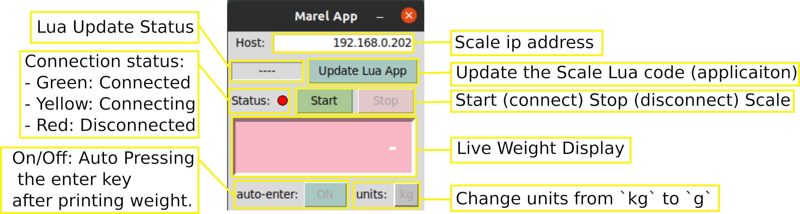

# marel_marine_scale_controller
Python Application to connect to a Marel Marine Scale M2200 and turn weight measurements into keyboard entry.

Note that this project was developed with the Marel Marine Scale M2200. Therefore, there are no guarantees that it will work with other models.

# Table of Contents

1. [Download](#download)
2. [Requirements](#requirements)
3. [Usage](#usage) 
   * 3.1 [Marel Marine Scale M2202](#marel-marine-scale-m2200)
   * 3.2 [Lua Application](#scale-lua-application)
   * 3.3 [Python Application](#python-application)
4. [Additionnal information](#additional-information)

# Download

The GUI App is packaged as standalone (self-contained) executable for Windows and Linux.


For Windows:
1. Download from the latest release [here](https://github.com/iml-gddaiss/marel_marine_scale_controller/releases) 
2. Unzip `MarelApp-windows.zip`
3. Run `MarelApp.exe`

# Requirements

+ Python >= 3.10

# Usage

## Marel Marine Scale M2200

[//]: # (From the Marel [documentation]&#40;./docs/marel_marine_m2200_user_guide.pdf&#41; )

`(Default Service Password: 62735)`

`(Default W&M Config password: 322225)`

The `Page` key:
<p align='center'>

</p>

 
+ Press the `Page` key to browse through the pages and to exit pages.
+ Hold the `Page` to access the scale menu fom which you can access the different pages (screens). 

The follow settings options are required in order to use the Scale with the Python Application.
From the Menu page: go to the options page,

+ `4-System Setup -> System -> Configuration -> Options`
  + `Select top menu cycle` : `2-Application [Yes]`
  + `Allow Lua source update` : `Yes`
  + `Run Lua script` : `Yes`

Set the IP address, to any available on your local network, (TODO VÉRIFIER)
+ `4-System Setup -> System -> Configuration -> Communications`
  + `Ip Address`: `192.168.X.XXX`
  


## Scale Lua Application
The Lua Application runs on the Marel Scale.

**Note** On first usage, the Lua Script needs to be uploaded to the scale. see section [Python Application](#python-application) 


On the scale, the Lua Application is displayed on the `2-Application` page. The page is accessible from the page menu (screen #2) or by cycling through the page (see section [Marel Marine Scale M220](#marel-marine-scale-m2200))

<p align='center'>

</p>

While program 1 is running, the weight value is continuously sent (e.i. `%w,1.234kg#\n`, see section [Additional Information/Lua Script](#lua-script)) and
on the main page (`1-Scale`) a `Print` key will be  available. 
Pressing the `Print` key sends a print message (e.i. `%p,1.234kg#\n`, see section [Additional Information/Lua Script](#lua-script)).

<p align='center'>

</p>


<p align='center'>

</p>

The Python Application stores the latest values and the GUI displays it.
When receiving a `Print` messages, the Python Application emulates a keyboard entry of that given value.
When a print message is sent the `Print` key displays: `>>>>`.

## Python Application

The [GUI](marel_marine_scale_controller/gui.py) is used to interface with the [Controller](marel_marine_scale_controller/marel_controller.py) which is used to:

### The Controller
#### Create a Controller
```Python
>>> from marel_marine_scale_controller.marel_controller import MarelController
>>> controller = MarelController('host')
```

#### Connect the Controller (via ethernet) and start Listening
```Python
>>> controller.start_listening()
```
When listening, the controller:

- Stores the latest weight value and units (message prefixes `w` and `p`).
- Prints the latest received weight in a given units at the current cursor position (message prefix `p`).

#### Upload the compatible Lua Script to the Marel Scale
```Python
>>> controller.update_lua_code('path/to/script.lua')
```

#### Get the latest weight value
```Python
>>> controller.get_weight(units='kg')
```

### The GUI | MarelApp
<p align='center'>

</p>

**Note** The `Update Lua App` function doesn't require the App to be Connected since it uses different ports.


# Additional Information
## About the Marel Marine Scale M2200
The Marel [documentation](./docs/marel_marine_m2200_user_guide.pdf) doesn't really tell you how to connect to and interact with the scale. The following explanation is thus mostly empirical. 

The scale has allocated memory for a Lua script which can be written/overwritten by uploading a Lua files to the scale if the option `Allow Lua source update` set to `yes` (see section [Marel Marine Scale M2200](#marel-marine-scale-m2200). 
Then, if the scale options `Run Lua Script` is set to `Yes`, the script is run in loop by a Lua interpreter.
It seems like a new Lua Interpreter is used on each loop, thus the Lua Script should itself be looping to avoid closing and opening new interpreters each time which cost time.
Note that a new interpreter needs to be launched for a Lua code update to be run, thus if one is already running, it needs to close. 

The scale has 7 different tcp servers ports for communication, from the documentation we have:

+ 52200 dot commands
+ 52202 download Lua source, if allowed 
+ 52203 upload Lua source
+ 52210 Lua standard output, for example using Lua print()
+ 52211 message port “comm4” in Lua, persistent output queue
+ 52212 terminal port “comm5” in Luae
+ 52213 remote host port “comm6” in Lua 

Note:
- The Lua Script is uploaded via the `52202` download port, and downloaded form the `52203` upload port.
- The port `52211`, `52212` and `52213` can be use has Communications port.


While it seems that some of the "built-in" Lua functions are missing from the Lua interpreter (note that I might be wrong here),
the Marel [documentation](./docs/marel_marine_m2200_user_guide.pdf) provides a list of available Lua functions to interface with the scale and manipulate (format) weight values.
Using the Marel [documentation](./docs/marel_marine_m2200_user_guide.pdf) and the Lua script provided ([marel_app_v2.lua](marel_marine_scale_controller/static/marel_app_v2.lua)), one could figure out how to make their own Lua application for the Scale.


## Lua Script:
Apart from the graphical user interface on the Sreen #2 of the scale (see section [Usage/Scale](#scale)), 
the [Lua application](marel_marine_scale_controller/static/marel_app_v2.lua) is used to send weight measurements over the ethernet communication port `5`(`52212`).
The message format is as follows `%<prefix>,<weight><units>#\n`, where:
```
    prefix: `"w"` or `"p"`.
    weight: float of variable precision.
    units: Unit of the weight `("kg", "g", "lb", "oz")`.
```
e.g. `%w,1.234kg#\n`
Messages with the prefix `"w"` are sent at regular intervals while `"p"` messages are sent when the assign [key](#scale-lua-application) on the Scale is pressed.
When receiving `"p"` messages, the Controller emulates a keyboard entry of that given values.
